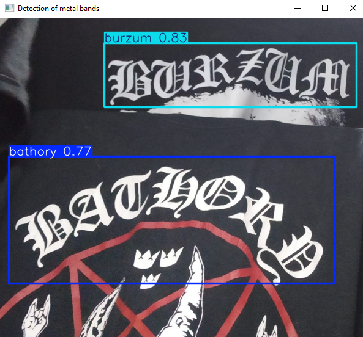
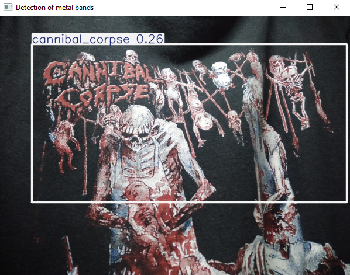

# Metal Band Logo Detector

This project uses a YOLO (You Only Look Once) model to detect metal band logos in images and videos. The detection is performed using the Ultralytics YOLO library and OpenCV for image and video processing.

## Overview

The `MetalBandLogoDetector` class allows you to detect logos in both video files and images. The class resizes frames if a specific width is provided. Detected logos are annotated and displayed using OpenCV. As of now, the detector is configured to recognize logos from three metal bands: Bathory, Burzum, and Cannibal Corpse.

## Requirements

- `Python 3.x`
- `opencv-python`
- `ultralytics`

You can install the required Python packages using pip:

```bash
pip install -r requirements.txt
```

## Supported Bands
Currently, the detector is configured to recognize logos from the following metal bands:
- Bathory
- Burzum
- Cannibal Corpse

## Examples
<div align="center">
    
    
</div>